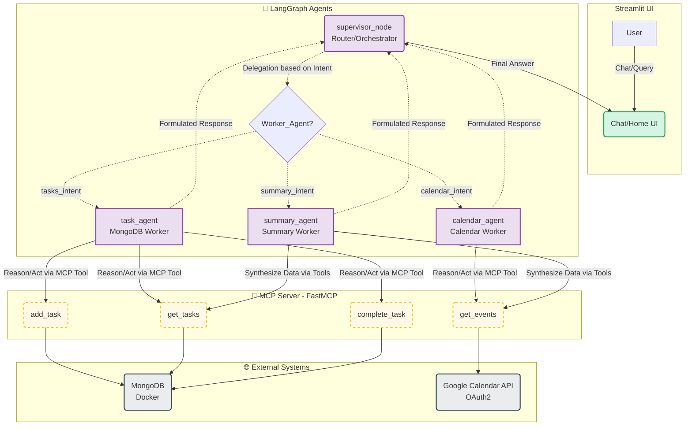

# 🤖 AGENTA - Asistente Personal con IA

AGENTA es un asistente personal inteligente diseñado para ayudarte a gestionar tu día a día. Se integra directamente con tu base de datos de tareas y tu Google Calendar para ofrecerte resúmenes diarios, recordatorios y una interfaz de chat conversacional para interactuar con tu agenda.

---

## Stack Tecnológico

* **Interfaz de Usuario (UI):** [Streamlit](https://streamlit.io/) para una experiencia web interactiva (Chat, Home, Gestor de Tareas).
* **Orquestación de IA:** [LangGraph](https://python.langchain.com/v0.1/docs/langgraph/) y LangChain para el enrutamiento y la lógica de estado.
* **Modelos de Lenguaje (LLM):** OpenAI (GPT-4o / GPT-4o-mini) configurados con temperatura baja para asegurar decisiones precisas.
* **Integración de Datos:** Protocolo [MCP (Model Context Protocol)](https://modelcontextprotocol.io/) utilizando la librería `fastmcp`.
* **Base de Datos:** MongoDB para el almacenamiento persistente de tareas pendientes y completadas.
* **APIs Externas:** Google Calendar API para la lectura en tiempo real de eventos y reuniones.
* **Despliegue:** Docker y Docker Compose para la contenerización y ejecución simplificada.

---

## Uso de Agentes de IA para resolución de problemas

Para evitar que un solo modelo se confunda intentando hacer todo a la vez, AGENTA utiliza una arquitectura basada en **Agentes Especializados (Workers)**. Cada agente tiene un prompt específico y acceso exclusivo a las herramientas que necesita para resolver su parte del problema mediante el framework ReAct (Reasoning and Acting).

El sistema se compone de los siguientes agentes:
1.  **Task Agent (Gestor de Tareas):** Especialista en interactuar con MongoDB. Puede leer, agregar y marcar tareas como completadas.
2.  **Calendar Agent (Asistente de Calendario):** Su único trabajo es consultar la disponibilidad y las reuniones del usuario a través de Google Calendar.
3.  **Summary Agent (Asistente Personal):** Encargado de la interacción amigable, generación de resúmenes diarios, revisión del ecosistema general y sugerencias de preparativos para el día siguiente.

---

## Explicación y manejo de MCPs (Model Context Protocol)

El proyecto implementa un Servidor MCP (`mcp_server.py`) de forma nativa. 

**¿Qué es MCP?**
El Model Context Protocol es un estándar abierto que permite a los modelos de IA conectarse a fuentes de datos externas de forma segura y estandarizada. En lugar de escribir código espagueti en los prompts para leer una base de datos, levantamos un "Servidor de Herramientas".

**Manejo en AGENTA:**
En este proyecto, `mcp_server.py` levanta un servidor a través de `stdio` (entrada/salida estándar) utilizando `FastMCP`. Este servidor expone cuatro herramientas vitales:
* `get_events`: Se conecta a la API de Google y trae los eventos formateados.
* `get_tasks`: Consulta MongoDB filtrando por tareas completadas o pendientes.
* `add_task`: Inserta un nuevo documento en la colección de Mongo.
* `complete_task`: Actualiza el estado de una tarea por su ID.

Luego, desde `agent.py`, el cliente MCP se conecta a este servidor de forma invisible, permitiendo que los agentes de LangChain invoquen estas funciones reales en el entorno local.

---

## Explicación de protocolo A2A (Agent to Agent)

El funcionamiento de AGENTA reside en su flujo de trabajo **A2A (Agent-to-Agent)** orquestado por LangGraph. No es un simple chatbot de pregunta-respuesta, sino un grafo de estados por donde viaja la información.

**El Flujo del Grafo:**
1.  **El Supervisor:** Cuando el usuario hace una consulta, el mensaje entra primero al `supervisor_node`. Este agente actúa como el "router" o jefe de operaciones. Su trabajo no es responder, sino analizar la intención del usuario y decidir qué especialista debe actuar.
2.  **Derivación (Routing):** Basado en la decisión del supervisor, el flujo salta al nodo correspondiente (`task_agent`, `calendar_agent`, o `summary_agent`).
3.  **Ejecución y Retorno:** El especialista ejecuta su lógica, utiliza sus herramientas MCP, formula una respuesta y el ciclo vuelve al supervisor (o termina si la consulta fue completamente resuelta). 



## Guía de instalación
AGENTA está preparado para ejecutarse fácilmente en entornos aislados gracias a Docker. Sigue estos pasos para ponerlo en marcha:

1. Requisitos previos
Tener instalado Docker y Docker Compose.

Una API Key de OpenAI.

Una cuenta de Google Cloud para generar credenciales de tipo Aplicación Web.

2. Configuración del entorno
Clona el repositorio y crea tu archivo de variables de entorno:

```bash
touch .env
```
Edita el archivo .env e ingresa tu clave real de OpenAI:

```bash
OPENAI_API_KEY=sk-tu-clave-real-aqui
MONGO_URI=mongodb://mongodb:27017  # Mantenlo así si usas Docker
```

3. Autenticación de Google Calendar
AGENTA maneja el inicio de sesión de Google de forma nativa desde la interfaz web. Para que esto funcione:

Ve a la Consola de Google Cloud y crea una credencial de tipo ID de cliente de OAuth 2.0.

Al crearla, asegúrate de seleccionar el Tipo de aplicación como Aplicación Web.

En la sección URI de redireccionamiento autorizados, agrega explícitamente http://localhost:8501.

Descarga el archivo JSON generado, renómbralo exactamente a `credentials.json` y colócalo en la raíz de este proyecto.

(Nota: La aplicación generará y gestionará el archivo token.json automáticamente la primera vez que inicies sesión desde la plataforma, no necesitas ejecutar scripts adicionales).

4. Ejecución con Docker Compose
Construye y levanta los servicios (MongoDB + Aplicación Streamlit):

```bash
docker-compose up -d --build
```

La base de datos MongoDB estará corriendo en el puerto 27017.

El contenedor de la aplicación instalará las dependencias de requirements.txt automáticamente.

5. Acceso a la interfaz
Una vez que los contenedores estén corriendo:

Abre tu navegador y visita: http://localhost:8501

En la barra lateral, haz clic en el botón "Conectar con Google Calendar" para autorizar el acceso a tu cuenta. ¡Y listo!